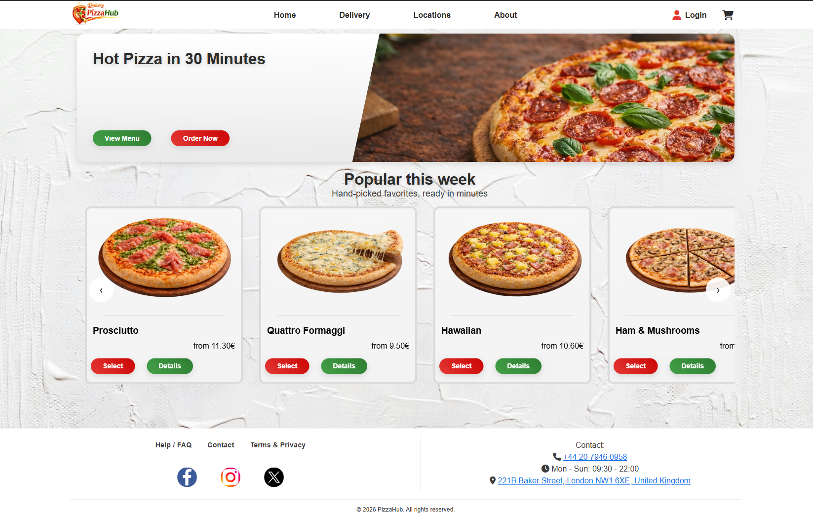

# PizzaHub

PizzaHub is a web ordering product for a restaurant menu experience. It lets customers browse food categories, inspect product details, manage a cart, enter delivery information, and move through an order confirmation flow.

The product is currently in active development. Core browsing, authentication, cart, checkout, feedback, delivery information, and legal content flows are implemented; order persistence, payment processing, and promotion content are planned functionality.

## Application

[Open PizzaHub](https://pizza-hub-app.vercel.app)

## Preview



## Product Overview

PizzaHub focuses on a food ordering journey for a Berlin-based restaurant experience. The current product surface includes a homepage, category-driven menu, product detail pages, combo deals, cart management, checkout, account access, feedback, delivery, contact, and legal pages.

The ordering flow is guided from menu exploration to cart review, delivery details, payment selection, and confirmation. Order storage and real payment processing are not connected yet.

## Implemented User Workflows

- Browse all products and category pages for pizzas, burgers, desserts, and soft drinks.
- View product details with image, price, weight, description, and allergen information when available.
- Browse combo deals from a separate data source and open detail pages for individual deals.
- Add items to the cart, change quantities, remove items, and review subtotal, delivery fee, and total price.
- Complete a checkout form with validation for delivery details and phone number format.
- Create an account, sign in, sign out, request a password reset link, and save a new password through Supabase Auth.
- Submit feedback or enquiries through a validated form stored through Supabase.
- Read supporting delivery, contact, privacy policy, and terms pages.

## Architecture

PizzaHub is built as a React and TypeScript single page application with Vite. Routing is handled with React Router, with route-level pages in `src/pages` composing reusable components from `src/components` and shared UI elements from `src/ui`.

Application-level state is split by responsibility. `CartContext` manages cart items, quantities, totals, and cart messages. `UserContext` reads the Supabase session, stores the active user display name, and handles sign out.

Product browsing uses shared product components for list cards, carousel cards, category pages, and detail pages. Styling is scoped with CSS Modules and backed by global design tokens for color, spacing, typography, radius, shadows, and layout constraints.

## Data And Security

Supabase is used for authentication, product and category reads, combo deal reads, and feedback submission. The client is configured through Vite environment variables:

```bash
VITE_SUPABASE_URL=
VITE_SUPABASE_ANON_KEY=
```

No real keys or sensitive values are stored in this document. Database policies and internal security rules are not described here because they are not present in the repository.

## Main Technical Decisions

- Supabase provides one backend boundary for authentication, product data, category data, combo deals, and feedback messages.
- CSS Modules keep page and component styles scoped while still using shared design tokens from `src/index.css`.
- React Context is used for cart and user state that must be available across multiple routes.
- Product components are reused across menu categories, popular products, best sellers, combo deals, and detail views.

## Current Limitations

- Current limitation: checkout validates delivery details and shows confirmation, but it does not create a persistent order record.
- Current limitation: payment selection is shown in the interface, but no online payment provider is connected.
- Current limitation: cart state is stored in React state and resets after a full page reload.
- Currently in development: the promotions route exists, but promotion content is not populated yet.

## Technologies

- React
- TypeScript
- Vite
- React Router
- Supabase
- CSS Modules
- Lucide React
- libphonenumber-js
- ESLint

## Run Locally

```bash
git clone <repository-url>
cd pizza-hub-app
npm install
cp .env.example .env
npm run dev
```

Add valid Supabase values to `.env` before running features that depend on backend data or authentication.

## Available Scripts

```bash
npm run dev
npm run build
npm run lint
npm run preview
```
